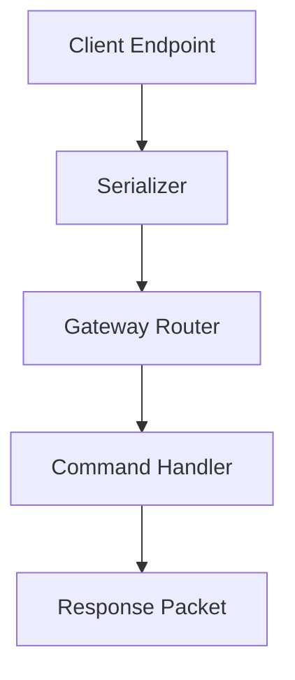

# 🌐 Gateway Protocol Simulator (C++17)

A custom-designed communication protocol for gateway-based message exchange.

Implements message serialization, command handling, and a scalable processing loop.

---

## 🚀 Features

- 📡 Endpoint-to-gateway message simulation
- 📨 Serialization & deserialization
- 🔍 Debug logging and packet inspection
- 🛠️ Extensible command architecture

---

## 🧩 Architecture Overview



---

## 🛠️ Build Instructions

### Build

```bash
mkdir build && cd build
cmake ..
make
```

### Run

```bash
./gateway_protocol
```

---

## 📚 Protocol Example

```
[HEADER][COMMAND_ID][PAYLOAD_LENGTH][PAYLOAD][CRC]
```

---

## 💡 What I Learned

- Designing custom binary protocols
- Packet framing & CRC validation
- Structuring low-level messaging logic

---

## 🚧 Future Improvements

- Add TCP socket communication
- Add encryption layer
- Implement asynchronous I/O

---

## 📜 License

MIT License
